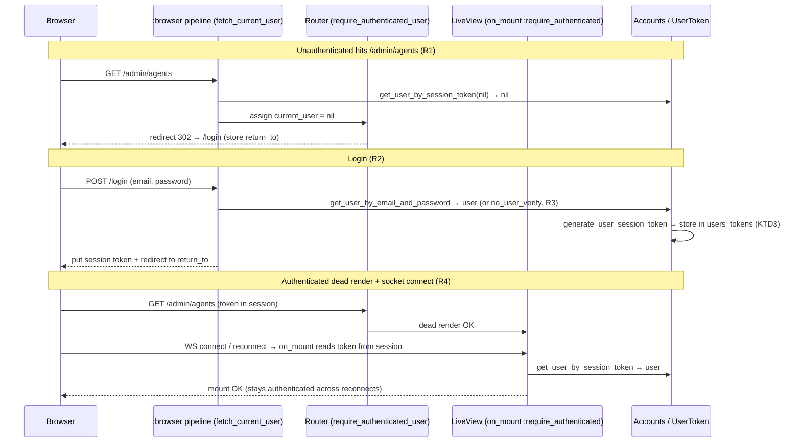

# feat: Phoenix-native user authentication for the admin UI

**Target repo:** andnative_ai (this repo)

Replace the Caddy-only basic-auth boundary with app-level email/password authentication implemented inside the Phoenix control panel. Access, sessions, and the durable auth boundary move from reverse-proxy config into the application, where future workspace/customer permissions can also live.

> **Product Contract preservation:** No upstream `ce-brainstorm` artifact exists. Requirements are carried directly from Linear AAI-18. Product scope is unchanged from the ticket.

---

## Problem Frame

The Hetzner demo is currently protected at the Caddy layer (`/opt/bold_mcp/deploy/Caddyfile`) with static basic-auth users. That is acceptable for a first demo but is the wrong auth model for partner or customer use: the auth boundary lives in reverse-proxy config, not the application, so the app has no concept of users, sessions, or permissions. We need Phoenix-native login/session handling so the durable boundary is in the app and can grow into workspace/customer permissions later.

**In scope:** app-level email/password auth for `/admin/*` and `/slack/install`, seeded demo users, logout, session expiration basics, password hashing with Phoenix defaults, and deploy-doc updates.

**Security constraint (hard):** Do not put the current basic-auth passwords in code, docs, or commits. Seed passwords come from environment variables only.

---

## Requirements

Carried from Linear AAI-18 acceptance criteria:

- **R1** — Visiting `/admin/agents`, `/admin/sources`, `/admin/slack`, or `/admin/control-plane` while unauthenticated redirects to login.
- **R2** — Seeded demo users (Marcel and Matt) can log in with app credentials and reach the admin UI.
- **R3** — Invalid credentials show a clear error **without** leaking whether the email exists (no user enumeration).
- **R4** — LiveView navigation remains authenticated after socket reconnects.
- **R5** — The Slack OAuth install flow still works after login: `/slack/install` requires an authenticated admin; `/slack/oauth/callback` remains reachable by Slack without authentication.
- **R6** — Logout ends the session; password hashing uses current Phoenix defaults; session expiration basics are in place.
- **R7** — Users table/schema/context exists for email/password authentication.
- **R8** — `m.fahle@gmail.com` (Marcel Fahle) is always seeded as the first user.
- **R9** — Tests cover: unauthenticated admin redirect, successful login, logout, protected LiveView route access, and Slack OAuth callback remains reachable.
- **R10** — Docs cover local setup, server deployment, and how to rotate/add users; Caddy basic auth is documented as removable or an optional outer belt.

---

## Key Technical Decisions

**KTD1 — Trim `phx.gen.auth` to a password-only Accounts context; do not run the 1.8 generator verbatim.**
Phoenix 1.8's `mix phx.gen.auth` generates magic-link login, sudo mode, registration/settings/confirmation LiveViews, a `Scope` struct, and a Swoosh mailer (`Swoosh` is **not** a dependency here). The acceptance criteria need only login, logout, session persistence, and seeded users — no email delivery, no public registration, no password reset. We hand-build a focused, password-first Accounts context modeled on the well-known `phx.gen.auth` structure (`User`, `UserToken`, `UserAuth`), omitting the email/magic-link/registration surface. This is "standard Phoenix auth" per the ticket while avoiding pulling in a mailer the demo does not need. *Rationale logged in Alternatives.*

**KTD2 — `bcrypt_elixir` for password hashing (current Phoenix default).** Add `{:bcrypt_elixir, "~> 3.0"}`. Reduce the cost factor in `config/test.exs` so the suite stays fast.

**KTD3 — DB-backed session tokens (`users_tokens`) + signed session cookie.** A random session token is stored in `users_tokens` and its raw value lives in the signed session cookie. `get_user_by_session_token/1` looks it up with a default 60-day validity window — this provides "session expiration basics" (R6). Logout deletes the token row, so it cannot be replayed. This is the `phx.gen.auth` session model minus the email-token variants.

**KTD4 — Protect `/admin/*` at BOTH the plug and `live_session`/`on_mount` levels.** The `require_authenticated_user` plug guards the initial dead-render HTTP request; an `on_mount` hook inside `live_session :require_authenticated_user` guards the LiveView socket connect and every reconnect. Both are required so that R4 (auth survives reconnect) and R1 (HTTP redirect) both hold. A `:mount_current_user` `on_mount` is also assigned so the layout can render the logged-in user and logout control.

**KTD5 — Split the router into a public scope and an authenticated scope.** `/slack/oauth/callback`, the login page, the logout action, and `/` stay public. `/slack/install` and all `/admin/*` lives move under `pipe_through [:browser, :require_authenticated_user]`. This directly satisfies R5: Slack can always reach the callback, but a human must be logged in to *start* the install.

**KTD6 — No user enumeration.** `Accounts.get_user_by_email_and_password/2` runs `Bcrypt.no_user_verify/0` when the email is unknown (constant-time, defeats timing oracles) and the login surface shows a single generic "Invalid email or password" message regardless of which field was wrong (R3).

**KTD7 — Login is a LiveView that POSTs to a plain controller.** A LiveView (`UserLoginLive`) renders the form for an idiomatic, reconnect-safe page, but it submits to `UserSessionController.create/2` because only a plain controller can write the session cookie. Logout is `UserSessionController.delete/2`. This is the standard `phx.gen.auth` login shape.

**KTD8 — Seed passwords come from environment variables; Marcel's email is fixed.** `priv/repo/seeds.exs` provisions `m.fahle@gmail.com` (Marcel, always first — R8) and Matt from env-driven passwords (e.g. `SEED_MARCEL_PASSWORD`, `SEED_MATT_PASSWORD`). No password ever appears in code, seeds, or docs (hard constraint). Seeding is idempotent (upsert by email) so re-running deploy seeds is safe.

**KTD9 — `citext` for case-insensitive unique email.** Add `CREATE EXTENSION IF NOT EXISTS citext` in the users migration, mirroring the existing `enable_pgvector` migration pattern (`execute "CREATE EXTENSION ..."`). Email is stored `:citext` with a unique index, so `Marcel@…` and `marcel@…` are the same account.

---

## High-Level Technical Design

### Authentication request flow



### Router scope structure (after change — KTD5)

| Scope | Pipeline | Routes |
| --- | --- | --- |
| Public | `:browser` | `GET /`, `GET /login` (LiveView), `POST /login`, `DELETE /logout`, `GET /slack/oauth/callback` |
| Authenticated | `:browser` + `require_authenticated_user` | `GET /slack/install`, `live_session :require_authenticated_user` → `/admin/control-plane`, `/admin/agents`, `/admin/sources`, `/admin/documents`, `/admin/slack`, `/admin/runtime` |
| API (unchanged) | `:api` | `POST /api/memory/search` |
| Dev only (unchanged) | `:browser` | `/dev/dashboard` |

---

## Output Structure

New files (existing files modified are listed per-unit, not here):

```text
lib/andnative_ai/
  accounts.ex                         # context (U3)
  accounts/
    user.ex                           # schema + changesets (U3)
    user_token.ex                     # session token schema (U3)
lib/andnative_ai_web/
  user_auth.ex                        # plugs + on_mount hooks (U4)
  controllers/
    user_session_controller.ex        # create/delete session (U5)
  live/
    user_login_live.ex                # login LiveView (U5)
priv/repo/migrations/
  <ts>_create_users_auth_tables.exs   # citext + users + users_tokens (U2)
test/andnative_ai/
  accounts_test.exs                   # context tests (U8)
test/andnative_ai_web/
  user_auth_test.exs                  # plug + on_mount tests (U8)
  live/user_login_live_test.exs       # login/logout flow tests (U8)
test/support/
  fixtures/accounts_fixtures.ex       # user_fixture / valid attrs (U8)
```

---

## Implementation Units

Grouped into three phases. Units are dependency-ordered. U-IDs are stable.

### Phase A — Data foundation

### U1. Add password-hashing dependency and test tuning

**Goal:** Make `bcrypt_elixir` available and keep the test suite fast.
**Requirements:** R6 (Phoenix-default hashing).
**Dependencies:** none.
**Files:** `mix.exs`, `mix.lock`, `config/test.exs`.
**Approach:** Add `{:bcrypt_elixir, "~> 3.0"}` to `deps/0`. In `config/test.exs`, set `config :bcrypt_elixir, :log_rounds, 1` so hashing in tests is cheap. Run `mix deps.get`.
**Patterns to follow:** existing `deps/0` list in `mix.exs`; existing per-env config blocks in `config/test.exs`.
**Test scenarios:** `Test expectation: none — dependency/config only; behavior is exercised by U3/U8 tests.`
**Verification:** `mix deps.get` resolves; project compiles; `Bcrypt` module is available in `iex -S mix`.

### U2. Migration: citext extension + users and users_tokens tables

**Goal:** Persist users and DB-backed session tokens.
**Requirements:** R7, R3 (case-insensitive email via citext), R6/KTD3 (token storage).
**Dependencies:** none (can land in parallel with U1).
**Files:** `priv/repo/migrations/<timestamp>_create_users_auth_tables.exs`.
**Approach:**
- `execute "CREATE EXTENSION IF NOT EXISTS citext", "DROP EXTENSION IF EXISTS citext"` (mirror `20260627185000_enable_pgvector.exs`).
- `users`: `email :citext, null: false`, `hashed_password :string, null: false`, `confirmed_at :utc_datetime` (nullable; reserved for future use, not exercised now), `timestamps(type: :utc_datetime)`. Add `create unique_index(:users, [:email])`.
- `users_tokens`: `user_id references(:users, on_delete: :delete_all), null: false`, `token :binary, null: false`, `context :string, null: false`, `sent_to :string`, `timestamps(type: :utc_datetime, updated_at: false)`. Add `create index(:users_tokens, [:user_id])` and `create unique_index(:users_tokens, [:context, :token])`.
**Patterns to follow:** `priv/repo/migrations/20260628080000_create_slack_installations.exs` (table + references + indexes), `20260627185000_enable_pgvector.exs` (extension via `execute`).
**Test scenarios:** `Test expectation: none — schema migration; correctness verified via U3 context tests and a successful migrate.`
**Verification:** `mix ecto.migrate` then `mix ecto.rollback` both succeed; `users` and `users_tokens` exist with the unique indexes.

### U3. Accounts context, User schema, UserToken schema

**Goal:** The data layer and context API for email/password auth and session tokens.
**Requirements:** R2, R3, R6, R7, R8 (creation path for seeds).
**Dependencies:** U1, U2.
**Files:** `lib/andnative_ai/accounts.ex`, `lib/andnative_ai/accounts/user.ex`, `lib/andnative_ai/accounts/user_token.ex`, `test/andnative_ai/accounts_test.exs` (added in U8 but co-designed here).
**Approach:**
- `User` schema: `email`, `hashed_password` (`redact: true`), `confirmed_at`, `virtual password (redact)`. Changesets: `registration_changeset/2` (validate email format + uniqueness via `unsafe_validate_unique` + DB constraint; validate password length ≥ 12 and hash with `Bcrypt.hash_pwd_salt/1`) and `valid_password?/2` using `Bcrypt.verify_pass/2` with `Bcrypt.no_user_verify/0` fallback.
- `UserToken` schema + helpers: `build_session_token/1` (random 32 bytes, store raw in cookie + DB with context `"session"`), `verify_session_token_query/1` with `@session_validity_in_days 60`.
- `Accounts` context functions: `get_user!/1`, `get_user_by_email/1`, `get_user_by_email_and_password/2` (runs `User.valid_password?` and `no_user_verify` on miss — KTD6), `register_user/1` (used by seeds), `generate_user_session_token/1`, `get_user_by_session_token/1`, `delete_user_session_token/1`.
**Patterns to follow:** `lib/andnative_ai/memory.ex` (context module with `alias AndnativeAi.Repo`, `import Ecto.Query`), `lib/andnative_ai/memory/tenant.ex` (schema + `changeset` + `unique_constraint`). Match the canonical `phx.gen.auth` Accounts/User/UserToken shapes for the function bodies.
**Test scenarios (authored in U8, designed here):**
- `register_user/1` with valid attrs creates a user with a non-nil `hashed_password` and the raw password is not stored. *Covers R7.*
- `register_user/1` rejects a duplicate email (case-insensitive: `Marcel@x` vs `marcel@x`) — returns `{:error, changeset}` with a uniqueness error. *Covers R3 citext.*
- `register_user/1` rejects a password shorter than the minimum length.
- `get_user_by_email_and_password/2` returns the user for correct credentials. *Covers R2.*
- `get_user_by_email_and_password/2` returns `nil` for a wrong password and for an unknown email, and does not raise. *Covers R3/KTD6.*
- `generate_user_session_token/1` then `get_user_by_session_token/1` round-trips to the same user.
- `delete_user_session_token/1` invalidates the token so a subsequent `get_user_by_session_token/1` returns `nil`. *Covers R6 logout.*
**Verification:** `mix test test/andnative_ai/accounts_test.exs` green; no plaintext password persisted.

### Phase B — Web auth plumbing

### U4. UserAuth: plugs and LiveView on_mount hooks

**Goal:** Wire the session token into the conn and the LiveView socket, and gate access.
**Requirements:** R1, R4, R5, R6.
**Dependencies:** U3.
**Files:** `lib/andnative_ai_web/user_auth.ex`, `test/andnative_ai_web/user_auth_test.exs` (U8).
**Approach:** Implement the canonical `phx.gen.auth` web auth module:
- `log_in_user/3` — renews the session, writes the token, redirects to `return_to` or a default; `log_out_user/1` — deletes the DB token, clears+renews session, broadcasts LiveSocket disconnect.
- `fetch_current_user/2` — reads the token from the session, assigns `current_user`.
- `require_authenticated_user/2` — when `current_user` is nil, stores the requested path with `maybe_store_return_to`, puts a flash, and redirects to `/login` (R1).
- `redirect_if_user_is_authenticated/2` — for the login page.
- `on_mount/4` clauses: `:mount_current_user` (assigns `current_user` to the socket) and `:require_authenticated` (redirects to `/login` via `halt` when absent — R4, covers reconnect).
- **Layout-compat note:** `lib/andnative_ai_web/components/layouts.ex` `app/1` declares a `current_scope` attr. Either assign a minimal `current_scope` or standardize the layout to `current_user`; pick one and apply consistently. Do not leave the layout referencing an unassigned key.
**Patterns to follow:** canonical `phx.gen.auth` `*_auth.ex`; endpoint `@session_options` already exposes the session to the LiveView socket (`connect_info: [session: ...]`) so `on_mount` can read the token.
**Test scenarios (authored in U8):**
- `fetch_current_user` assigns the user when a valid session token is present, and `nil` otherwise.
- `require_authenticated_user` redirects to `/login` and halts when unauthenticated; stores `return_to` for GET. *Covers R1.*
- `require_authenticated_user` passes through when authenticated.
- `log_out_user` deletes the token row and clears the session. *Covers R6.*
- `on_mount :require_authenticated` returns `{:halt, …}` with a redirect when the socket session has no/invalid token, and `{:cont, …}` when valid. *Covers R4.*
**Verification:** `mix test test/andnative_ai_web/user_auth_test.exs` green.

### U5. Login LiveView, session controller, and layout logout control

**Goal:** A working login page, a session create/delete controller, and a visible logout affordance.
**Requirements:** R2, R3, R6.
**Dependencies:** U4.
**Files:** `lib/andnative_ai_web/live/user_login_live.ex`, `lib/andnative_ai_web/controllers/user_session_controller.ex`, `lib/andnative_ai_web/components/layouts.ex` (add logout link + current user), `test/andnative_ai_web/live/user_login_live_test.exs` (U8).
**Approach:**
- `UserLoginLive` renders a `<.form for={@form} action={~p"/login"}>` using `<.input>` for email + password and `<.button>` to submit (this repo uses Phoenix 1.8 core components — `<.form>` + `<.input>`, there is no `simple_form`). Show a single generic flash on failure (R3).
- `UserSessionController.create/2` calls `Accounts.get_user_by_email_and_password/2`; on success `UserAuth.log_in_user/3` (redirect to `return_to` or `/admin/control-plane`), on failure re-render login with the generic error and the email preserved.
- `UserSessionController.delete/2` calls `UserAuth.log_out_user/1` and redirects to `/login` with an info flash.
- In `layouts.ex` `app/1`, add a logout `<.link href={~p"/logout"} method="delete">` and show the current user's email next to the theme toggle (only when present).
**Patterns to follow:** `lib/andnative_ai_web/live/admin/control_plane_live.ex` (`use AndnativeAiWeb, :live_view`, `<Layouts.app flash={@flash}>` wrapper, `render/1` with `~H`), `core_components.ex` `input/1`, `button/1`, `flash/1`.
**Test scenarios (authored in U8):**
- GET `/login` renders the email + password form.
- POST `/login` with valid seeded credentials sets a session token and redirects into `/admin/*`. *Covers R2.*
- POST `/login` with a wrong password renders the generic error and does **not** reveal that the email exists; same generic error for an unknown email. *Covers R3.*
- An authenticated user visiting `/login` is redirected away (`redirect_if_user_is_authenticated`).
- DELETE `/logout` clears the session and redirects to `/login`. *Covers R6.*
**Verification:** `mix test test/andnative_ai_web/live/user_login_live_test.exs` green; manual login/logout works in the browser.

### U6. Router wiring: public vs authenticated scopes and live_session

**Goal:** Enforce the auth boundary at the router (R1, R5).
**Requirements:** R1, R4, R5.
**Dependencies:** U4, U5.
**Files:** `lib/andnative_ai_web/router.ex`.
**Approach:** Per KTD5 / HTD table:
- Add `plug :fetch_current_user` to the `:browser` pipeline.
- Public `scope "/"`: `get "/"`, login routes (`live "/login", UserLoginLive` inside a `live_session :current_user, on_mount: [{UserAuth, :mount_current_user}]`; `post "/login", UserSessionController, :create`; `delete "/logout", UserSessionController, :delete`), and `get "/slack/oauth/callback", SlackOAuthController, :callback` (**must stay public — R5**).
- Authenticated `scope "/"`, `pipe_through [:browser, :require_authenticated_user]`: `get "/slack/install", SlackOAuthController, :install`, and a `live_session :require_authenticated_user, on_mount: [{UserAuth, :require_authenticated}]` wrapping all six `/admin/*` lives (`control-plane`, `agents`, `sources`, `documents`, `slack`, `runtime`).
- Leave the `:api` scope and the dev-only `/dev/dashboard` unchanged (see Scope Boundaries).
**Patterns to follow:** existing `router.ex` scope/pipeline structure; canonical `phx.gen.auth` router blocks.
**Test scenarios (covered in U8 via route tests):**
- Unauthenticated GET of each `/admin/*` route → 302 to `/login`. *Covers R1.*
- Unauthenticated GET `/slack/install` → 302 to `/login`. *Covers R5.*
- Unauthenticated GET `/slack/oauth/callback` is **reachable** (not redirected to login). *Covers R5/R9.*
- `/` stays publicly reachable.
**Verification:** route assertions in U8 pass; `mix phx.routes` shows admin routes under the authenticated `live_session`.

### Phase C — Provisioning, tests, docs

### U7. Seed and rotate demo users

**Goal:** Provision Marcel and Matt operationally without putting passwords in code.
**Requirements:** R2, R8, R10 (rotate/add users path).
**Dependencies:** U3.
**Files:** `priv/repo/seeds.exs` (extend), optionally `lib/andnative_ai/accounts.ex` reuse — no new mix task required.
**Approach:**
- In `seeds.exs`, after `Memory.ensure_demo_tenant!()`, idempotently provision users from env (KTD8): always `m.fahle@gmail.com` for Marcel (R8); Matt's email from `SEED_MATT_EMAIL` (with a clearly-placeholder default that the operator overrides). Passwords from `SEED_MARCEL_PASSWORD` / `SEED_MATT_PASSWORD`. If a password env var is unset, **skip that user with a logged notice** rather than inventing a password — never hardcode one.
- Idempotency: look up by email; insert only when absent (so re-running deploy seeds does not error or reset passwords).
- "Rotate/add users" path: document (in U9) running `mix run priv/repo/seeds.exs` with the env vars set, or `iex -S mix` + `Accounts.register_user/1`. No secret material in the repo.
**Patterns to follow:** existing `priv/repo/seeds.exs` (`alias AndnativeAi.Memory` + `ensure_demo_tenant!()`), `Memory.ensure_demo_tenant!/0` idempotent get-or-create pattern.
**Test scenarios:** `Test expectation: none — operational script. The creation path it exercises (register_user/1) is covered by U3/U8.`
**Verification:** with the env vars set, `mix run priv/repo/seeds.exs` creates Marcel + Matt; re-running does not duplicate or error; the seeded users can log in (manual check against U5).

### U8. Test coverage: fixtures, helpers, new and updated suites

**Goal:** Prove the acceptance criteria and repair existing tests broken by the new auth boundary.
**Requirements:** R9 (all listed coverage), and guards for R1–R6.
**Dependencies:** U3, U4, U5, U6.
**Files:**
- New: `test/support/fixtures/accounts_fixtures.ex`, `test/andnative_ai/accounts_test.exs`, `test/andnative_ai_web/user_auth_test.exs`, `test/andnative_ai_web/live/user_login_live_test.exs`.
- Modified: `test/support/conn_case.ex` (add `register_and_log_in_user/1` + `log_in_user/2` helpers), `test/andnative_ai_web/controllers/slack_oauth_controller_test.exs`, `test/andnative_ai_web/live/admin/agents_live_test.exs`, `test/andnative_ai_web/live/admin/control_plane_live_test.exs`, `test/andnative_ai_web/live/admin/documents_live_test.exs`, `test/andnative_ai_web/live/admin/status_pages_test.exs`.
**Approach:**
- `AccountsFixtures`: `valid_user_attributes/1`, `user_fixture/1` (via `Accounts.register_user/1`).
- `conn_case` helpers: `register_and_log_in_user/1` (creates a user, generates a session token, `Plug.Test.put_session(conn, :user_token, token)`), and `log_in_user/2`. Mirror the canonical `phx.gen.auth` helpers.
- **Update the four admin LiveView tests** to call `register_and_log_in_user` in `setup` so `live(conn, ~p"/admin/...")` reaches the page instead of redirecting. Add at least one explicit unauthenticated-redirect assertion (can live in `user_auth_test` or a small router test) for R1.
- **Update `slack_oauth_controller_test.exs`:** `/slack/install` tests must authenticate first (now behind `require_authenticated_user`). Keep session continuity (login → install sets `slack_oauth_state` → callback) so the existing install/callback exchange test still passes. **Add an explicit test** that `/slack/oauth/callback` is reachable **unauthenticated** (R5/R9).
**Patterns to follow:** `test/andnative_ai_web/controllers/slack_oauth_controller_test.exs` (`init_test_session`, `~p` sigils), `test/support/conn_case.ex` (existing `using`/`setup`), canonical `phx.gen.auth` fixtures and conn helpers.
**Test scenarios (this unit *is* the test suite — explicit cases):**
- Unauthenticated admin redirect: GET `/admin/agents` (and the other three) → 302 `/login`. *Covers R1/R9.*
- Successful login → reaches admin UI. *Covers R2/R9.*
- Logout ends session and blocks admin again. *Covers R6/R9.*
- Protected LiveView route access works once authenticated, including after a simulated reconnect. *Covers R4/R9.*
- Slack OAuth callback remains reachable unauthenticated; install requires auth then works. *Covers R5/R9.*
- No-enumeration: wrong password vs unknown email produce identical generic errors. *Covers R3.*
**Verification:** `mix test` green across the whole suite (not just new files); no admin test left unauthenticated-by-accident.

### U9. Update deploy and setup docs

**Goal:** Document the new app-level auth boundary, local setup, deployment, and user rotation — with no passwords in docs.
**Requirements:** R10.
**Dependencies:** U6, U7 (so documented commands match reality).
**Files:** `docs/hetzner-demo-deploy.md` (primary), and a short local-setup note.
**Approach:**
- Update the **Caddy** section: app-level login is now the durable auth boundary; Caddy `basic_auth` can be removed or kept only as an optional outer belt. Do not include any passwords or hashes.
- Add a **Users / auth** section: how to seed Marcel + Matt via `mix run priv/repo/seeds.exs` with `SEED_MARCEL_PASSWORD` / `SEED_MATT_PASSWORD` (and `SEED_MATT_EMAIL`) set in the environment; how to rotate/add a user. Note that `m.fahle@gmail.com` is always the first user.
- Update the **Verify** section and **Auto Deploy From Main** verify step to reflect the app-level login boundary (unauthenticated app access now redirects to `/login`).
**Patterns to follow:** existing structure and tone of `docs/hetzner-demo-deploy.md`.
**Test scenarios:** `Test expectation: none — documentation. Cross-check that every command and env var named here matches U6/U7 reality.`
**Verification:** doc references resolve to real routes/env vars/commands; no secret material present.

---

## Scope Boundaries

**In scope:** everything in Requirements R1–R10.

### Deferred to Follow-Up Work
- **API authentication** for `POST /api/memory/search` — currently unauthenticated; out of scope for this ticket (admin UI only).
- **Dev LiveDashboard** (`/dev/dashboard`) auth — already `dev_routes`-gated and not exposed in prod.
- **Public self-service registration, password reset, email confirmation, magic links** — intentionally omitted (KTD1).
- **Workspace/customer permissions / roles** — future; the Accounts context is the foundation only.
- **Encrypting the session cookie** (`:encryption_salt`) — signed-but-not-encrypted is the current app default.

### Out of Scope (non-goals)
- Migrating or preserving the existing Caddy basic-auth credentials into the app (the ticket forbids copying those passwords anywhere).
- Changing the Slack Socket Mode / app-token flow.

---

## System-Wide Impact

- **Router is the blast radius.** Adding `require_authenticated_user` to `/admin/*` and `/slack/install` breaks every existing test that mounts those routes unauthenticated (four admin LiveView test files + the Slack install tests). U8 must update all of them in the same change or CI goes red.
- **Layout coupling.** `Layouts.app/1` declares `current_scope`; U4/U5 must keep that contract satisfied or every admin page render fails.
- **Deploy semantics shift.** After this lands, the durable auth boundary is the app, not Caddy. U9 updates the doc, and the operator decides whether to keep Caddy basic auth as an outer belt before removing it.

---

## Risks & Dependencies

| Risk | Likelihood | Impact | Mitigation |
| --- | --- | --- | --- |
| Existing admin/Slack tests left unauthenticated → CI red | High if forgotten | Medium | U8 enumerates every file to update; `grep -rl '~p"/admin' test` is the checklist. |
| Slack `/slack/oauth/callback` accidentally placed behind auth → Slack can't complete install | Medium | High (breaks R5) | KTD5 keeps callback in the public scope; U8 adds an explicit unauthenticated-callback test. |
| LiveView reconnect drops auth (only plug-level guard) | Medium | High (breaks R4) | KTD4 requires `on_mount` inside `live_session`, not just the plug. |
| Seed passwords leak into repo/docs | Low | High (ticket hard constraint) | KTD8 + U7/U9: env-var only; skip-with-notice when unset; placeholders stay placeholders. |
| `citext` extension not enabled in some environment | Low | Medium | U2 enables it in-migration (`CREATE EXTENSION IF NOT EXISTS`), same as pgvector. |

**External dependencies:** `bcrypt_elixir` (new hex dep), Postgres `citext` extension (already-used `execute` pattern), existing session/LiveView socket config in `endpoint.ex` (already exposes session to the socket — no change needed).

---

## Assumptions

- **Matt's email is operator-supplied** via `SEED_MATT_EMAIL`. Only Marcel's `m.fahle@gmail.com` is fixed (R8).
- **No public registration** is desired — users are seeded/provisioned.
- **Login/logout paths** are `/login` and `/logout`.
- **Minimum password length** is 12 characters.
- **`/` landing page stays public.**

---

## Definition of Done

- All of R1–R10 satisfied; every Acceptance row has a passing test (or documented manual check for R8/R10).
- `mix test` is green across the **entire** suite, including the updated admin and Slack tests.
- `mix ecto.migrate` / `mix ecto.rollback` both succeed.
- No password or secret appears in code, seeds, or docs.
- `docs/hetzner-demo-deploy.md` reflects the app-level boundary, user seeding/rotation, and the Caddy-as-optional-belt posture.
- PR opened against `main` per the ticket; work performed in a git worktree per the request.

---

## Verification Contract

1. `mix compile --warnings-as-errors` (or the project's compile gate) succeeds.
2. `mix ecto.migrate` applies the users tables; `mix ecto.rollback` reverts cleanly.
3. `mix test` — full suite green.
4. Manual smoke (dev): visit `/admin/agents` logged out → redirected to `/login`; log in as seeded Marcel → reach admin; navigate between admin pages (reconnect) → stay authenticated; start `/slack/install` → redirects through Slack; log out → `/admin/*` blocked again.
5. `grep -rn` for the basic-auth passwords / any secret returns nothing in tracked files.

---

## Acceptance Examples → Coverage

| Criterion | Where satisfied | Where tested |
| --- | --- | --- |
| Unauthenticated `/admin/*` redirects to login (R1) | U6 | U8 (admin redirect cases) |
| Marcel & Matt log in (R2) | U5, U7 | U8 (successful login) |
| Generic error, no enumeration (R3) | U3, U5 | U8 (wrong-pw vs unknown-email) |
| LiveView auth survives reconnect (R4) | U4, U6 | U8 (protected live access) |
| Slack install needs auth; callback public (R5) | U6 | U8 (install auth + public callback) |
| Logout + session basics + hashing (R6) | U3, U4, U5 | U8 (logout) |
| Users table/schema/context (R7) | U2, U3 | U8 (Accounts tests) |
| `m.fahle@gmail.com` always first (R8) | U7 | manual / seed idempotency |
| Test coverage list (R9) | — | U8 (all enumerated) |
| Docs: setup, deploy, rotate, Caddy optional (R10) | U9 | doc cross-check |

---

## Sources & Research

- **Origin:** Linear AAI-18 (https://linear.app/boldvideo/issue/AAI-18). Acceptance criteria carried verbatim into Requirements.
- **Codebase patterns:** `lib/andnative_ai/memory.ex`, `lib/andnative_ai/memory/tenant.ex`, `lib/andnative_ai_web/router.ex`, `lib/andnative_ai_web/endpoint.ex` (session wired to LiveView socket), `lib/andnative_ai_web/components/layouts.ex` (`current_scope` attr), `lib/andnative_ai_web/components/core_components.ex` (`input`/`button`/`flash` — Phoenix 1.8, no `simple_form`), `lib/andnative_ai_web/controllers/slack_oauth_controller.ex` + test, `priv/repo/migrations/20260627185000_enable_pgvector.exs` (extension-via-`execute`), `test/support/conn_case.ex` / `data_case.ex`, four admin LiveView test files.
- **Pattern reference:** canonical `mix phx.gen.auth` Accounts / UserToken / UserAuth password flow (Phoenix 1.8), trimmed to password-only per KTD1.
