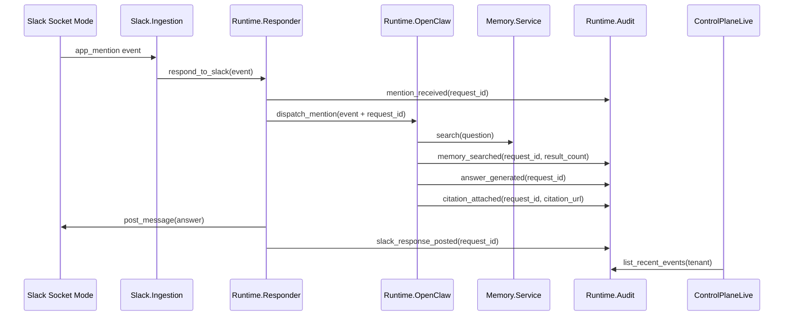
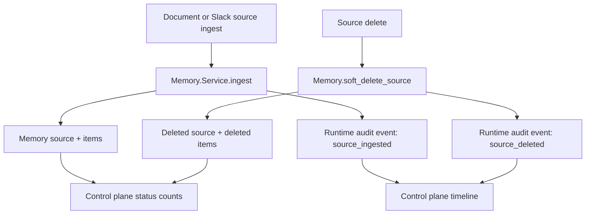

# Runtime Audit Control Plane - Plan

## Goal Capsule

| Field | Value |
|---|---|
| Objective | Replace the control-plane demo story feed with a functional governance/admin surface backed by persisted runtime audit evidence. |
| Authority | User direction in the AAI-13/AAI-14 review, current repo behavior, and the existing Slack/memory/runtime architecture. |
| Execution profile | Standard software change touching Ecto schema, runtime instrumentation, LiveView UI, tests, and handoff docs. |
| Stop conditions | Stop if the event model would require a product decision about compliance-grade immutability, multi-tenant billing, or a different runtime contract. |
| Tail ownership | `ce-work` implements the plan, then LFG review/browser/PR steps verify and ship it. |

---

## Product Contract

### Summary

The control plane should read as a serious governance tool: current agents, connected sources, runtime health, and a chronological record of what happened.
The timeline should no longer fabricate memory search, answer, citation, or approval events on every refresh.
It should show real persisted evidence when the app ingests sources, deletes sources, receives Slack mentions, searches memory, generates answers, attaches citations, posts responses, or encounters runtime failures.

### Problem Frame

AAI-13 and AAI-14 were implemented as a visually heavy prospect dashboard with explicit demo fallback events.
That technically satisfied the original tickets, but it made the PoC feel fake and obscured the product truth.
The app now needs the small durable event spine that lets the UI stay restrained while showing evidence the agent actually produced.

### Requirements

**Runtime evidence**

- R1. Persist audit events for the demo tenant with tenant, optional agent/source/memory item links, event kind, component, status, request correlation, metadata, optional citation URL, and occurrence timestamp.
- R2. Correlate one Slack mention run across its runtime steps with a stable request ID so the timeline can show a coherent trace.
- R3. Record real source lifecycle events for ingestion/indexing and source deletion from the existing memory paths.
- R4. Record real Slack/runtime events for mention received, memory searched, answer generated, citation attached, response posted, and runtime/model errors.

**Control plane**

- R5. Show operational state in a compact admin layout: agents, sync status, Slack installs/channels, document sources, memory chunks, and recent runtime activity.
- R6. Replace decorative appliance/orbit styling with restrained panels, dense status rows, badges, and audit rows that match the existing app shell.
- R7. Show an empty timeline state when no events exist instead of synthetic live-looking rows.
- R8. Keep any remaining fallback/demo-only state visibly labeled and out of the primary evidence count.

**Governance semantics**

- R9. Timeline rows must include timestamp, event kind badge, actor/component, short description, status, request ID when present, and citation/source link when present.
- R10. Search and answer behavior must keep existing memory semantics: deleted sources stay excluded, bot questions are not ingested as knowledge, and agent identity still affects model-backed answers.
- R11. The change must preserve the one-tenant PoC and avoid adding compliance-grade audit immutability or policy-engine scope.
- R12. Audit metadata must avoid storing full Slack payloads, bot tokens, raw user questions, or answer bodies by default; store IDs, counts, statuses, citations, and bounded error details instead.

### Acceptance Examples

- AE1. Given an empty demo tenant, when a user opens `/admin/control-plane`, then the timeline shows an empty state and no fabricated `memory_searched`, `answer_generated`, `citation_attached`, or `approval_paused` rows.
- AE2. Given a document upload, when ingestion completes, then the event store contains source/memory indexing events and the control plane shows those rows as live evidence.
- AE3. Given a Slack mention that gets answered from memory, when the runtime responds, then the event store contains a shared request ID across memory search, answer generation, citation attachment, and Slack response posting.
- AE4. Given a source delete, when search runs afterward, then deleted items are excluded and the timeline shows a source deletion event tied to the deleted source.
- AE5. Given no paused approval implementation, when the control plane renders, then it does not imply a live approval pause happened.

### Scope Boundaries

In scope:

- Persisted runtime audit events for the current one-tenant PoC.
- Instrumentation at existing app boundaries.
- A calmer LiveView control plane driven by real persisted events and live status counts.
- Tests and docs for the new event spine and revised UI semantics.

Deferred to follow-up work:

- Compliance-grade append-only audit storage, tamper evidence, retention policy, and export.
- A full policy engine or real human approval workflow.
- Multi-tenant customer isolation beyond the existing tenant column.
- Rich Slack app/bot message ingestion for Linear posts; that remains the separate Linear-ingest work.
- Real OpenClaw event streaming if OpenClaw later exposes its own event bus.

### Sources

- AAI-13: prospect-facing control plane status cards.
- AAI-14: governed runtime audit timeline.
- `docs/architecture-handoff.md`
- `docs/decisions.md`
- `lib/andnative_ai/control_plane.ex`
- `lib/andnative_ai/runtime/open_claw.ex`
- `lib/andnative_ai/runtime/responder.ex`
- `lib/andnative_ai/slack/ingestion.ex`
- `lib/andnative_ai/memory/service.ex`

---

## Planning Contract

### Key Technical Decisions

- KTD1. Persist audit events in a first-class Ecto schema instead of reconstructing runtime rows from `memory_sources`. Source rows describe source state; audit rows describe what happened.
- KTD2. Keep the event store simple and relational: `runtime_audit_events` belongs to tenant and optionally references agent, source, and memory item. Flexible metadata stays in a JSON map for bounded Slack IDs, result counts, errors, and citation details, not whole payloads or answer bodies.
- KTD3. Generate request IDs at the responder boundary and pass them down through the Slack event map/options. This avoids widening the runtime adapter behavior immediately while still correlating runtime events.
- KTD4. Instrument boundaries we own now rather than scraping OpenClaw. Slack ingestion, memory service, memory search, runtime answer composition, and Slack response posting are enough to prove the run.
- KTD5. The control plane should display no synthetic runtime events by default. Empty state is a product truth and is better than fake evidence.
- KTD6. Keep UI styling inside the current Phoenix/Tailwind/DaisyUI footprint. Use compact panels and tables/lists, not a new design system or decorative landing-page composition.

### High-Level Technical Design

### Assumptions

- The event table can store plaintext metadata for the PoC, matching the current plaintext Slack token caveat.
- Current test coverage can use direct context calls and LiveView tests; no new browser-only behavior is required for correctness.
- The first implementation should favor clear persisted evidence over real-time streaming. Manual refresh is acceptable.

### System-Wide Impact

- Persistent data shape changes through a migration.
- Runtime and Slack paths gain write-side effects for audit rows.
- The control plane becomes less demo-driven and more state-driven.
- Docs and decisions must be updated so future agents do not reintroduce synthetic runtime events as the primary story.

### Risks & Dependencies

| Risk | Mitigation |
|---|---|
| Audit writes could break answering if they raise inside runtime paths. | Audit recording should be best-effort where appropriate and tested around happy/error paths. |
| Event metadata could drift into an unstructured dump. | Keep top-level fields stable and reserve metadata for contextual details only. |
| UI could become too sparse on fresh demos. | Use empty states and status counts, not fabricated audit rows. |
| Tests may depend on event ordering at second precision. | Store occurrence timestamps and sort by `occurred_at` then `id` where needed. |

---

## Implementation Units

### U1. Runtime audit event spine

- **Goal:** Add the persisted audit event model, context API, and query helpers.
- **Requirements:** R1, R2, R9, R12.
- **Dependencies:** None.
- **Files:** `priv/repo/migrations/20260628160000_create_runtime_audit_events.exs`, `lib/andnative_ai/runtime/audit_event.ex`, `lib/andnative_ai/runtime/audit.ex`, `test/andnative_ai/runtime/audit_test.exs`.
- **Approach:** Create a `runtime_audit_events` table keyed by tenant with optional `agent_id`, `source_id`, and `memory_item_id` references. Store `request_id`, `event_kind`, `component`, `actor`, `status`, `summary`, minimized `metadata`, `citation_url`, and `occurred_at`. Add context functions for `record_event/1`, `list_recent_events/2`, and small helpers for best-effort recording.
- **Patterns to follow:** `AndnativeAi.Memory` context functions, Ecto schemas under `lib/andnative_ai/memory`, and migration style in `priv/repo/migrations`.
- **Test scenarios:** Creating a valid event persists required fields and default metadata. Listing recent events filters by tenant, excludes other tenants, sorts newest first, and respects a limit. Optional links to agent/source/item can be nil or populated. Invalid missing fields return changeset errors. Metadata helper behavior drops or rejects secret-like keys and overlong raw text fields.
- **Verification:** Unit tests prove event creation, validation, tenant filtering, and ordering.

### U2. Source lifecycle audit instrumentation

- **Goal:** Record real source ingestion, memory indexing, and source deletion events from existing document and Slack source flows.
- **Requirements:** R3, R9, R10.
- **Dependencies:** U1.
- **Files:** `lib/andnative_ai/memory/service.ex`, `lib/andnative_ai/memory.ex`, `test/andnative_ai/memory/service_test.exs`, `test/andnative_ai/sources/document_ingestion_test.exs`, `test/andnative_ai/slack/ingestion_test.exs`.
- **Approach:** Record source lifecycle events when `Service.ingest/6` finishes and when `Memory.soft_delete_source/2` deletes a source and its items. Include source IDs, source type, item count, citation/source URL, and channel/source metadata. Keep search filtering behavior unchanged.
- **Patterns to follow:** Existing transaction boundaries in `Service.ingest/6` and `Memory.soft_delete_source/2`.
- **Test scenarios:** Document upload creates a `source_ingested` event with a citation URL and item count. Slack channel join/backfill creates source lifecycle evidence for the channel source. Source deletion creates `source_deleted` with deleted item count. Search still returns no deleted source memory after deletion.
- **Verification:** Existing document/slack ingestion tests gain event assertions without weakening search/delete assertions.

### U3. Slack/runtime run audit instrumentation

- **Goal:** Record one correlated audit trail for each answered Slack mention.
- **Requirements:** R2, R4, R9, R10, R12.
- **Dependencies:** U1.
- **Files:** `lib/andnative_ai/runtime/responder.ex`, `lib/andnative_ai/runtime/open_claw.ex`, `lib/andnative_ai/runtime/memory_tool.ex`, `test/andnative_ai/runtime/open_claw_test.exs`, `test/andnative_ai/slack/ingestion_test.exs`.
- **Approach:** Generate or preserve a request ID at the responder boundary. Record `slack_mention_received`, `memory_searched`, `answer_generated`, `citation_attached`, `slack_response_posted`, and error events where the current code has enough information. Pass request context through existing event/options maps instead of changing the adapter behavior, and persist only minimized identifiers/counts/statuses rather than raw Slack text or answer bodies.
- **Patterns to follow:** `Responder.respond_to_slack/3` as the boundary for mention gating and response posting, `OpenClaw.dispatch_mention/2` as the memory-search and answer boundary, and the existing OpenAI fallback tests.
- **Test scenarios:** A Slack app mention that posts an answer records all expected runtime event kinds with the same request ID. A direct `OpenClaw.dispatch_mention/2` call records memory search and answer events. Empty search results still record memory search and answer events. A posting failure or runtime error records a failure event without losing the original return semantics. Runtime audit metadata does not include the bot token, raw Slack question, or full answer body.
- **Verification:** Runtime tests assert event correlation, event kind coverage, and unchanged answer/citation behavior.

### U4. Functional control-plane snapshot and LiveView

- **Goal:** Replace the decorative control-plane hero and synthetic runtime events with compact operational cards and a real event timeline.
- **Requirements:** R5, R6, R7, R8, R9.
- **Dependencies:** U1, U2, U3.
- **Files:** `lib/andnative_ai/control_plane.ex`, `lib/andnative_ai_web/live/admin/control_plane_live.ex`, `test/andnative_ai_web/live/admin/control_plane_live_test.exs`.
- **Approach:** Build the snapshot from agents, sources, memory items, Slack installs, OpenClaw health, and `Runtime.Audit.list_recent_events/2`. Remove automatic demo runtime events. Render a restrained admin dashboard with compact stat cards, action-needed states, and a timeline table/list. Show an empty state when there are no audit events. Keep stable DOM IDs for tests and browser checks.
- **Patterns to follow:** Existing `Layouts.app` wrapper, status page tests under `test/andnative_ai_web/live/admin`, and app-shell styling in `lib/andnative_ai_web/components/layouts.ex`.
- **Test scenarios:** Fresh tenant renders no synthetic runtime event rows and shows an empty timeline state. Ingested/deleted source events render as live timeline rows. Runtime events render with kind, component, status, request ID, and citation link. Status cards reflect live counts for agents, sources, memory chunks, Slack installs, and synced agents. Layout-critical elements have stable IDs for browser testing.
- **Verification:** LiveView tests prove empty, source, and runtime event states without relying on fabricated fallback events.

### U5. Documentation and decision updates

- **Goal:** Update durable docs so future work treats persisted audit events as the product direction.
- **Requirements:** R8, R11.
- **Dependencies:** U1, U2, U3, U4.
- **Files:** `docs/architecture-handoff.md`, `docs/decisions.md`, `README.md`.
- **Approach:** Update architecture docs to include `runtime_audit_events`, the request/run trace, and the revised control-plane behavior. Replace DEC-012's demo-fallback wording with the new persisted-audit decision or add a superseding decision. Keep deploy/runbook docs untouched unless implementation changes them.
- **Patterns to follow:** Existing concise decision-log style and the post-PR docs-audit rule in `AGENTS.md`.
- **Test scenarios:** Test expectation: none -- docs-only unit.
- **Verification:** Docs describe the implemented event model, UI semantics, limitations, and verification commands accurately.

---

## Verification Contract

| Gate | Applies to | Done signal |
|---|---|---|
| `mix test test/andnative_ai/runtime/audit_test.exs` | U1 | Audit event schema/context works in isolation. |
| `mix test test/andnative_ai/memory/service_test.exs test/andnative_ai/sources/document_ingestion_test.exs test/andnative_ai/slack/ingestion_test.exs` | U2, U3 | Source lifecycle and Slack runtime paths still ingest/search/delete/respond correctly while recording events. |
| `mix test test/andnative_ai/runtime/open_claw_test.exs` | U3 | Runtime answers keep existing behavior and write correlated audit rows. |
| `mix test test/andnative_ai_web/live/admin/control_plane_live_test.exs` | U4 | Control plane renders real status and timeline states without synthetic runtime rows. |
| `mix precommit` | All units | Full repo formatting, compile, and test checks pass. |
| Browser smoke through LFG `ce-test-browser` | U4 | `/admin/control-plane` is usable at desktop and mobile widths with no overlap, no horizontal scroll, and no sci-fi/decorative hero treatment. |

---

## Definition of Done

- U1 is done when runtime audit events persist, validate, query by tenant, and sort predictably.
- U2 is done when source ingest/delete paths record source lifecycle evidence and preserve current memory search/delete semantics.
- U3 is done when answered Slack mentions produce correlated runtime audit events without changing response behavior.
- U4 is done when `/admin/control-plane` is a restrained operational dashboard with real event rows and an honest empty state.
- U5 is done when architecture, decisions, and README docs describe the new event spine and no longer present synthetic runtime trust rows as the intended direction.
- The full plan is done when targeted tests, `mix precommit`, and browser smoke checks pass, and abandoned exploratory code is removed from the diff.
