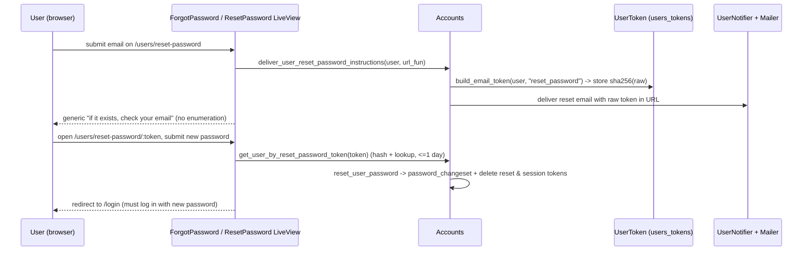
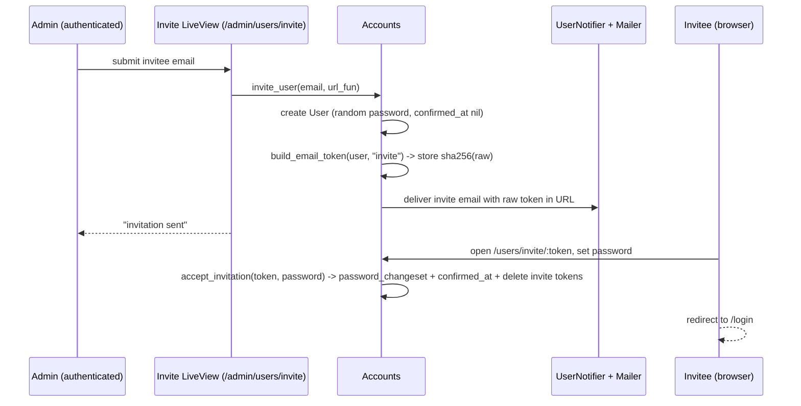

# feat: Admin account self-management (change password, reset, invite)

**Target repo:** andnative_ai (this repo)
**Builds on:** branch `feat/aai-18-phoenix-native-auth` / PR #2. The `Accounts`, `User`, `UserToken`, `UserAuth`, `Layouts.auth`, login/session controller, and the `users`/`users_tokens` tables exist **only on that branch**, not on `origin/main`. This plan extends that branch and PR — every "existing" reference below means the code already on this branch.

Adds the account-lifecycle features on top of the auth foundation: a logged-in admin can change their own password; a public forgot-password flow resets it by emailed link; an admin can invite new users by email; and the first admin is bootstrapped in a migration with a known, resettable default password. A lock-out guard prevents deleting the last remaining user.

---

## Problem Frame

The current auth (PR #2) can authenticate seeded admins but has **no self-service account management**: no way to change a password in-app, recover a forgotten one, or add a user without an `iex`/seed run. The deferred follow-ups from PR #2 (self-serve reset, invite flow) plus the user's new requirements (migration-seeded first admin with `changeme123`; never delete the last user) are the scope here.

**In scope:** change-password (authenticated), forgot/reset-password (public, emailed), invite-others (admin → emailed activation), Swoosh mailer, migration-seeded first admin, last-user delete guard.

**Security posture (hard rules):** reset/invite tokens are **hashed** at rest (SHA-256 of the emailed token); reset/forgot flows **never reveal whether an email exists**; no real secret (SMTP creds, etc.) lands in code or docs. The `changeme123` default is a deliberate, user-authorized bootstrap value the operator changes on first login — it is **not** the forbidden Caddy basic-auth secret.

---

## Requirements

- **R1** — The first admin (`m.fahle@gmail.com`) is seeded **in a migration** with password `changeme123`, idempotently (no-op if the row already exists). The operator logs in with it and changes it.
- **R2** — A logged-in admin can change their own password via a settings page: requires the current password, validates and rehashes the new one, and invalidates the user's other session tokens (current session stays logged in).
- **R3** — A public "forgot password" page emails a tokenized reset link for a known email; the message shown is identical whether or not the email exists (no enumeration). A set-new-password page consumes the token and updates the password.
- **R4** — A logged-in admin can invite a new user by email; the invitee receives an emailed link to set their initial password and activate the account.
- **R5** — Email is delivered via Swoosh + a `UserNotifier`. Dev/test use the Local (preview/in-memory) adapter — no real send. Prod selects an adapter from env and is **safe when unconfigured** (falls back to a non-crashing adapter). No secret in code/docs.
- **R6** — `Accounts.delete_user/1` refuses when only one user remains (the system can never be locked out). The guard lives at the context level.
- **R7** — Reset and invite tokens are stored as a **SHA-256 hash** in `users_tokens` under `"reset_password"` and `"invite"` contexts, with short validity (reset ~1 day, invite ~7 days); the raw token travels only in the email link. The existing verbatim **session** token path is unchanged.
- **R8** — `m.fahle@gmail.com` is always the first admin.

---

## Key Technical Decisions

**KTD1 — Hashed email tokens, reusing `users_tokens`.** Add `UserToken.build_email_token/2` and `verify_email_token_query/2` following the canonical `phx.gen.auth` design: generate 32 random bytes, email the URL-safe Base64 of the raw bytes, and store **`:crypto.hash(:sha256, raw)`** as the `token` with the context (`"reset_password"` / `"invite"`). Verification hashes the incoming token and looks it up within a context-specific validity window (`reset_password` = 1 day, `invite` = 7 days). Session tokens keep their existing verbatim storage — only email tokens are hashed (they leave the system in a URL, so a DB leak must not yield a usable token). *No `sent_to` column is reintroduced:* both email tokens bind to a `user_id`, which is sufficient here (there is no email-change flow to defend against).

**KTD2 — Swoosh mailer, safe-by-default.** Add `{:swoosh, "~> 1.16"}` and an `AndnativeAi.Mailer`. Config: `Swoosh.Adapters.Local` in dev and test (preview mailbox / in-memory `Swoosh.Adapters.Test`), and in prod read the adapter from env — when unset, **default to `Swoosh.Adapters.Local`** (logs/preview) rather than crashing or silently dropping. A real provider (SMTP via `gen_smtp`, or an API adapter) is wired only when the operator sets the env; document the env, never commit creds. `swoosh` needs no extra HTTP client for Local/Test.

**KTD3 — `update_user_password/3` invalidates other sessions.** Verify the current password (reuse `User.valid_password?`), apply a `User.password_changeset` (length ≥ 12, rehash), and in one transaction delete **all** the user's session tokens. The change-password controller then mints a fresh session for the current request via `UserAuth.log_in_user/2`, so the acting session stays in while every other session is forced to re-auth. *Net effect matches "rotate all except current."*

**KTD4 — First admin seeded in a data migration.** A new migration inserts `m.fahle@gmail.com` with `Bcrypt.hash_pwd_salt("changeme123")` only when the row is absent (`ON CONFLICT (email) DO NOTHING`, or an existence check). The plaintext `changeme123` is intentionally present (user-authorized bootstrap) with a clear comment. *Directional note:* computing the hash at migration runtime via `Bcrypt` is cleanest; if running app code inside a migration proves awkward, a precomputed bcrypt hash literal with a `# default password: changeme123` comment is an equivalent fallback. `seeds.exs` drops its Marcel entry (the migration now owns the first admin) and keeps the env-driven path for **additional** users.

**KTD5 — Invite creates the user row immediately; activation sets the real password.** `invite_user/2` creates the `User` with `confirmed_at: nil` and a **random, unguessable** password (so it satisfies the not-null hash and cannot be logged into), then delivers an `"invite"` token. `accept_invitation/2` consumes the token, sets the invitee's chosen password, and stamps `confirmed_at`. This reuses the `confirmed_at` field already on the schema and avoids needing to stash the invited email outside a `user_id`-bound token. Login is **not** gated on `confirmed_at` (keeps existing login behavior); an un-accepted invitee simply has no usable password.

**KTD6 — No enumeration on reset/forgot.** `deliver_user_reset_password_instructions/2` looks the user up by email and sends only if found, but the forgot-password page **always** shows the same "if that email exists, a reset link is on its way" message. The invite flow is admin-initiated, so it can surface real validation (e.g. "already a user") to the admin.

**KTD7 — Last-user delete guard.** `delete_user/1` checks `Repo.aggregate(User, :count)`; when it is 1, it returns `{:error, :last_user}` without deleting. Every deletion path goes through this function (there is no direct `Repo.delete` of a `User` elsewhere).

---

## High-Level Technical Design

### Password reset flow (R3)

### Invite / activation flow (R4)

### Route additions

| Scope | Routes |
| --- | --- |
| Public | `live "/users/reset-password"` (request), `live "/users/reset-password/:token"` (set new), `live "/users/invite/:token"` (accept) |
| Authenticated | `live "/users/settings"` (change password), `live "/admin/users/invite"` (admin invites) |

---

## Implementation Units

Phased; dependency-ordered; stable U-IDs. Tests are written alongside each unit (test-as-you-go), not deferred.

### Phase A — Mailer + token foundation

### U1. Swoosh mailer + config

**Goal:** Email delivery that is safe in every environment.
**Requirements:** R5.
**Dependencies:** none.
**Files:** `mix.exs`, `mix.lock`, `lib/andnative_ai/mailer.ex`, `config/config.exs`, `config/dev.exs`, `config/test.exs`, `config/runtime.exs`.
**Approach:** Add `{:swoosh, "~> 1.16"}`. `AndnativeAi.Mailer` uses `Swoosh.Mailer` for `:andnative_ai`. config.exs: default `adapter: Swoosh.Adapters.Local`. test.exs: `adapter: Swoosh.Adapters.Test` (so tests assert on delivered emails). dev.exs: `Local` (preview at `/dev/mailbox` via `Swoosh.Plug` — optional, dev-only). runtime.exs (prod): read adapter/creds from env; when unset, fall back to `Swoosh.Adapters.Local`. Disable Swoosh's default API client (`config :swoosh, :api_client, false`) since Local/Test/SMTP need none.
**Patterns to follow:** standard Phoenix 1.8 `Mailer` + Swoosh config; mirror existing per-env config blocks.
**Test scenarios:** `Test expectation: none — config/wiring; exercised by U3/U4/U5 email tests via the Test adapter.`
**Verification:** project compiles; `AndnativeAi.Mailer` exists; `mix test` boots with the Test adapter.

### U2. Hashed email tokens in `UserToken` + Accounts token plumbing

**Goal:** Reusable hashed-token build/verify for reset and invite.
**Requirements:** R7.
**Dependencies:** none (independent of U1).
**Files:** `lib/andnative_ai/accounts/user_token.ex`, `test/andnative_ai/accounts/user_token_test.exs` (new) or coverage folded into `accounts_test.exs`.
**Approach:** Add `@hash_algorithm :sha256`, `@reset_password_validity_in_days 1`, `@invite_validity_in_days 7`. `build_email_token/2` returns `{encoded_token, %UserToken{token: hashed, context: context, user_id: id}}` where `encoded_token = Base.url_encode64(raw, padding: false)` and `hashed = :crypto.hash(@hash_algorithm, raw)`. `verify_email_token_query/2` decodes the incoming token, hashes it, and queries by `[token: hashed, context: context]` joined to the user with `inserted_at > ago(days_for_context(context), "day")`. Keep `build_session_token/1` and `verify_session_token_query/1` unchanged.
**Patterns to follow:** the existing `verify_session_token_query/1` and `by_token_and_context_query/2` in this file; canonical `phx.gen.auth` `UserToken` email-token functions.
**Test scenarios:**
- `build_email_token` returns a URL-safe encoded token while persisting a 32-byte SHA-256 hash (encoded ≠ stored).
- `verify_email_token_query` finds the user for a valid, unexpired token; returns none for a wrong/garbage token, an expired token (backdate `inserted_at`), or a token used under the wrong context.
**Verification:** new token tests green; session-token tests still green.

### U3. UserNotifier (reset + invite emails)

**Goal:** The two transactional emails.
**Requirements:** R3, R4, R5.
**Dependencies:** U1.
**Files:** `lib/andnative_ai/accounts/user_notifier.ex`, `test/andnative_ai/accounts/user_notifier_test.exs` (new) or folded into the flow tests.
**Approach:** `UserNotifier` builds `Swoosh.Email` (from a sensible default sender, e.g. `"&native.ai <no-reply@andnativeai.marcelfahle.net>"`) and delivers via `AndnativeAi.Mailer`. `deliver_reset_password_instructions(user, url)` and `deliver_invitation(user, url)` with plain-text bodies containing the link. Return `{:ok, email}`.
**Patterns to follow:** canonical `phx.gen.auth` `UserNotifier`.
**Test scenarios:**
- Each notifier returns `{:ok, _}` and (via `Swoosh.Adapters.Test`) the delivered email has the right recipient, subject, and a body containing the link.
**Verification:** notifier tests green using the Test adapter (`assert_email_sent` / `Swoosh.TestAssertions`).

### Phase B — Accounts operations

### U4. Change-password, reset, and last-user delete guard

**Goal:** Context API for R2, R3, R6.
**Requirements:** R2, R3, R6.
**Dependencies:** U2, U3.
**Files:** `lib/andnative_ai/accounts.ex`, `lib/andnative_ai/accounts/user.ex` (add `password_changeset/3`), `test/andnative_ai/accounts_test.exs`.
**Approach:**
- `User.password_changeset/3` — casts `:password`, validates length, hashes (reuse `validate_password`/`maybe_hash_password` already in `user.ex`).
- `Accounts.update_user_password/3` — `User.valid_password?` gate on the current password, `password_changeset`, `Repo.update` + delete all the user's session tokens in a transaction (KTD3).
- `Accounts.deliver_user_reset_password_instructions/2` — look up by email; if found, `build_email_token(user, "reset_password")`, insert, send via `UserNotifier`. Always returns `:ok`-shaped result to the caller (no enumeration).
- `Accounts.get_user_by_reset_password_token/1` — `verify_email_token_query(token, "reset_password")` → user or nil.
- `Accounts.reset_user_password/2` — `password_changeset` + delete the user's `reset_password` and `session` tokens in a transaction.
- `Accounts.delete_user/1` — `{:error, :last_user}` when `Repo.aggregate(User, :count) <= 1`, else delete.
**Patterns to follow:** existing `Accounts` context functions; canonical `phx.gen.auth` reset functions; `Ecto.Multi` for the multi-step token deletions.
**Test scenarios:**
- `update_user_password` succeeds with the correct current password and rejects a wrong one; after success, a previously generated session token for that user no longer resolves.
- `reset_user_password` sets the new password and invalidates outstanding reset + session tokens.
- `get_user_by_reset_password_token` returns the user for a valid token and nil for expired/invalid.
- `deliver_user_reset_password_instructions` for an unknown email does not raise and sends no email; for a known email it sends one.
- `delete_user` refuses the last user (`{:error, :last_user}`) and succeeds when ≥2 users exist.
**Verification:** Accounts tests green.

### U5. Invite + accept-invitation operations

**Goal:** Context API for R4.
**Requirements:** R4.
**Dependencies:** U2, U3.
**Files:** `lib/andnative_ai/accounts.ex`, `lib/andnative_ai/accounts/user.ex` (an `invite_changeset` or reuse of registration with a random password), `test/andnative_ai/accounts_test.exs`.
**Approach:**
- `Accounts.invite_user/2` — create the `User` with a random password (`:crypto.strong_rand_bytes` → Base64, ≥ 12 chars) and `confirmed_at: nil`; on success `build_email_token(user, "invite")` + `UserNotifier.deliver_invitation`. Surface `{:error, changeset}` to the admin on a duplicate/invalid email (admin-initiated, so enumeration is not a concern here).
- `Accounts.get_user_by_invite_token/1` — `verify_email_token_query(token, "invite")`.
- `Accounts.accept_invitation/2` — `password_changeset` + set `confirmed_at` + delete the user's `invite` tokens, in a transaction.
**Patterns to follow:** U4's reset functions; `Ecto.Multi`.
**Test scenarios:**
- `invite_user` creates a user that cannot be logged into (random password) and sends an invite email; a duplicate email returns `{:error, changeset}`.
- `get_user_by_invite_token` resolves a valid token and rejects expired/invalid.
- `accept_invitation` sets the chosen password (the user can now authenticate), stamps `confirmed_at`, and invalidates the invite token (a second use fails).
**Verification:** Accounts tests green.

### Phase C — Web flows

### U6. Change-password settings page (authenticated)

**Goal:** R2 UI.
**Requirements:** R2.
**Dependencies:** U4.
**Files:** `lib/andnative_ai_web/live/user_settings_live.ex`, `lib/andnative_ai_web/router.ex`, `lib/andnative_ai_web/components/layouts.ex` (nav "Settings" link), `lib/andnative_ai_web/user_auth.ex` (a `sudo`-free settings session is fine), `test/andnative_ai_web/live/user_settings_live_test.exs` (new).
**Approach:** A `live "/users/settings"` inside the existing authenticated `live_session :require_authenticated_user`. The page shows a change-password form (`current_password`, `password`, `password_confirmation` optional). Submit handled either by `handle_event` calling `Accounts.update_user_password/3` then redirecting through a small controller action to refresh the session, **or** by posting to a `UserSessionController.update`-style action. Decision deferred to execution per repo fit; mirror the login LiveView→controller pattern so the session cookie can be rewritten after a password change. Add a "Settings" link in `Layouts.app` nav next to logout.
**Patterns to follow:** `user_login_live.ex` + `user_session_controller.ex` (LiveView form → controller for cookie writes), `core_components` `<.input>`.
**Test scenarios:**
- Authenticated user changes password with correct current password → success flash, can log in with the new password.
- Wrong current password → generic error, password unchanged.
- Unauthenticated GET `/users/settings` → redirect to `/login`.
**Verification:** settings tests green.

### U7. Forgot-password + reset-password pages (public)

**Goal:** R3 UI.
**Requirements:** R3.
**Dependencies:** U4.
**Files:** `lib/andnative_ai_web/live/user_forgot_password_live.ex`, `lib/andnative_ai_web/live/user_reset_password_live.ex`, `lib/andnative_ai_web/router.ex`, `lib/andnative_ai_web/components/layouts.ex` or the login page (a "Forgot your password?" link), `test/andnative_ai_web/live/user_reset_password_live_test.exs` (new).
**Approach:** Public `live "/users/reset-password"` (email form → `deliver_user_reset_password_instructions`, always shows the same confirmation) and `live "/users/reset-password/:token"` (loads the user via the token in `mount`; on submit calls `reset_user_password` then redirects to `/login`). Both wrap in `Layouts.auth`. Add a "Forgot your password?" link on the login page.
**Patterns to follow:** `Layouts.auth`, the login LiveView; canonical `phx.gen.auth` reset LiveViews.
**Test scenarios:**
- Submitting a known email sends a reset email (Test adapter) and shows the generic confirmation; an unknown email shows the **same** confirmation and sends nothing.
- A valid `:token` page resets the password (new password works at `/login`); the token cannot be reused; an invalid/expired token shows an error and does not reset.
- After reset, a previously valid session token for that user no longer authenticates.
**Verification:** reset tests green.

### U8. Invite page (admin) + accept-invitation page (public)

**Goal:** R4 UI.
**Requirements:** R4.
**Dependencies:** U5.
**Files:** `lib/andnative_ai_web/live/admin/user_invite_live.ex`, `lib/andnative_ai_web/live/user_accept_invitation_live.ex`, `lib/andnative_ai_web/router.ex`, nav link in `Layouts.app`, `test/andnative_ai_web/live/admin/user_invite_live_test.exs` (new).
**Approach:** Authenticated `live "/admin/users/invite"` (admin enters an email → `invite_user` → "invitation sent"; surfaces duplicate-email errors). Public `live "/users/invite/:token"` (loads the invited user via token; on submit `accept_invitation` then redirect to `/login`), wrapped in `Layouts.auth`. Add an "Invite" link to the authenticated nav.
**Patterns to follow:** U7 reset pages; the authenticated admin lives.
**Test scenarios:**
- Authenticated admin invites a new email → invite email sent (Test adapter); inviting an existing email shows an error.
- Unauthenticated GET `/admin/users/invite` → redirect to `/login`.
- A valid `:token` accept page activates the user (can then log in); reused/expired token is rejected.
**Verification:** invite tests green.

### Phase D — Bootstrap migration + docs

### U9. Migration: seed first admin with `changeme123`

**Goal:** R1, R8.
**Requirements:** R1, R8.
**Dependencies:** none (schema already exists; this is data).
**Files:** `priv/repo/migrations/<timestamp>_seed_first_admin.exs`, `priv/repo/seeds.exs` (drop the Marcel entry; keep additional-user path).
**Approach:** In `up`, insert `m.fahle@gmail.com` with `Bcrypt.hash_pwd_salt("changeme123")` and timestamps, guarded by `ON CONFLICT (email) DO NOTHING` (or an existence check) so re-runs and existing data are safe. Clear comment: `# default password: changeme123 — change it on first login`. `down` deletes only that seeded row by email. Update `seeds.exs` so Marcel is no longer seeded there (migration owns him); leave the env-driven additional-user mechanism intact.
**Patterns to follow:** existing migrations' `execute` usage; `Bcrypt` from `user.ex`.
**Test scenarios:** `Test expectation: none — data migration. Idempotency + the seeded login are covered by a quick `mix ecto.migrate` and an Accounts assertion that `get_user_by_email_and_password("m.fahle@gmail.com", "changeme123")` returns the user.`
**Verification:** `mix ecto.migrate` then `mix ecto.rollback` succeed; the seeded admin authenticates with `changeme123`; re-running migrate does not duplicate or error.

### U10. Docs

**Goal:** R1, R3, R4, R5 operator docs.
**Requirements:** R1, R3, R4, R5.
**Dependencies:** U6, U7, U8, U9.
**Files:** `docs/hetzner-demo-deploy.md`.
**Approach:** Update the "Admin authentication" section: first login uses `m.fahle@gmail.com` / `changeme123` (seeded by migration) — change it immediately at `/users/settings`. Document the forgot-password and invite flows, and the **email-provider env** (which vars select/configure the prod adapter; that emails are previewed locally in dev; that an unconfigured prod safely falls back). No secrets.
**Test scenarios:** `Test expectation: none — docs. Cross-check every route/env/command against U6–U9 reality.`
**Verification:** doc references resolve; no secret material; `changeme123` documented as the change-on-first-login default.

---

## Scope Boundaries

**In scope:** R1–R8.

### Deferred to Follow-Up Work
- **Rate limiting** on `/login`, forgot-password, and invite endpoints (brute-force / email-bomb protection) — still deferred from PR #2.
- **Session-cookie `Secure`/`force_ssl`** hardening — deferred from PR #2 (deployment-nuanced behind Caddy).
- **Email-change flow** and **account deletion UI** — not requested; `delete_user/1` exists as a guarded primitive but no admin delete page is built here.
- **`confirmed_at`-gated login** / email confirmation for self-registration — login stays open to any user with a usable password.
- A real **production email provider** wiring (SMTP/API creds) — the code is provider-ready via env; configuring an actual provider is an ops task.

### Out of Scope (non-goals)
- Roles/permissions beyond "is an authenticated admin".
- Changing the existing session-token (verbatim) design.

---

## System-Wide Impact

- **`users_tokens` now holds three token classes** (`session` verbatim, `reset_password`/`invite` hashed). Verification paths must not cross contexts; tests assert context isolation.
- **Password change / reset invalidate sessions** — after either, other sessions for that user stop working on their next request/reconnect (consistent with the existing `on_mount` re-check). Intended.
- **New mailer dependency** boots in all envs; test uses the Test adapter, so the suite stays hermetic (no network).
- **Migration seeds data** — a slightly unconventional but explicitly requested bootstrap; idempotent and reversible.

---

## Risks & Dependencies

| Risk | Likelihood | Impact | Mitigation |
| --- | --- | --- | --- |
| Reset/invite token leak via DB read | Low | High | KTD1: tokens stored as SHA-256; raw token only in the email link. |
| Email enumeration via forgot-password | Medium | Medium | KTD6: identical response for known/unknown emails; no timing-sensitive branch beyond the existing bcrypt-less lookup. |
| `Bcrypt` unavailable inside the migration | Low | Medium | KTD4 fallback: precomputed bcrypt hash literal if runtime hashing in a migration misbehaves. |
| Unconfigured prod mailer drops resets/invites silently | Medium | Medium | KTD2: default to Local/preview (visible), document the env; surface delivery in logs. |
| Password change locks the admin out of other devices unexpectedly | Low | Low | Documented behavior; current session is preserved. |
| Last-user guard bypassed by a direct `Repo.delete` | Low | High | KTD7: single `delete_user/1` path; no other `User` deletion in the codebase. |

**External dependencies:** `swoosh` (new), the existing `Accounts`/`UserToken`/`UserAuth`/`Layouts.auth` foundation on this branch, `bcrypt_elixir` (already present).

---

## Assumptions

- **Reset validity 1 day, invite validity 7 days** (reasonable defaults; adjustable).
- **Invite creates the user immediately** with a random password + `confirmed_at: nil` (KTD5), rather than deferring user creation to acceptance.
- **Login is not gated on `confirmed_at`** — keeps existing behavior; an un-accepted invitee just has no usable password.
- **Default sender** is a no-reply address on the demo domain; the operator overrides via config/env in prod.
- **`changeme123`** is the agreed bootstrap password (user-authorized), documented as change-on-first-login.

---

## Definition of Done

- R1–R8 satisfied; each acceptance behavior has a passing test (or a documented manual check for R1/R5 docs).
- `mix precommit` green across the whole suite (compile `--warnings-as-errors`, format, tests) — email assertions via the Swoosh Test adapter, no network.
- `mix ecto.migrate` / `mix ecto.rollback` succeed; the migration-seeded admin logs in with `changeme123` and can change it.
- No secret (SMTP creds, etc.) in code or docs; `changeme123` is the only (intentional) credential literal, clearly marked.
- Work continues on `feat/aai-18-phoenix-native-auth`; PR #2 is updated (not a new PR).

---

## Verification Contract

1. `mix compile --warnings-as-errors` clean.
2. `mix ecto.migrate` seeds the admin; `mix ecto.rollback` reverts cleanly; re-migrate is idempotent.
3. `mix test` / `mix precommit` — full suite green, including the new change-password, reset, invite, token, and notifier tests (emails asserted via `Swoosh.Adapters.Test`).
4. Manual smoke (dev): log in as `m.fahle@gmail.com` / `changeme123` → `/users/settings` change password → log out → log in with the new one; forgot-password → open the preview email link → reset; invite an email → open the preview link → set password → log in.
5. `grep` confirms no SMTP/provider secret in tracked files.

---

## Sources & Research

- **Origin:** PR #2 / branch `feat/aai-18-phoenix-native-auth` (the auth foundation this extends) and its deferred follow-ups; the user's added requirements (migration-seeded `changeme123`; never delete the last user).
- **Codebase patterns (this branch):** `lib/andnative_ai/accounts.ex`, `lib/andnative_ai/accounts/user.ex` (`registration_changeset`, `valid_password?`, `maybe_hash_password`), `lib/andnative_ai/accounts/user_token.ex` (session-token build/verify, `by_token_and_context_query`), `lib/andnative_ai_web/user_auth.ex`, `lib/andnative_ai_web/live/user_login_live.ex` + `controllers/user_session_controller.ex` (LiveView→controller for cookie writes), `lib/andnative_ai_web/components/layouts.ex` (`Layouts.auth`), `test/support/conn_case.ex` (`register_and_log_in_user`), `priv/repo/migrations/20260628090000_create_users_auth_tables.exs`.
- **Pattern reference:** canonical `mix phx.gen.auth` email-token (`UserToken.build_email_token`/`verify_email_token_query`), `UserNotifier`, reset/settings LiveViews, and Swoosh `Mailer` setup — adapted to this app's password-only, admin-only shape.
