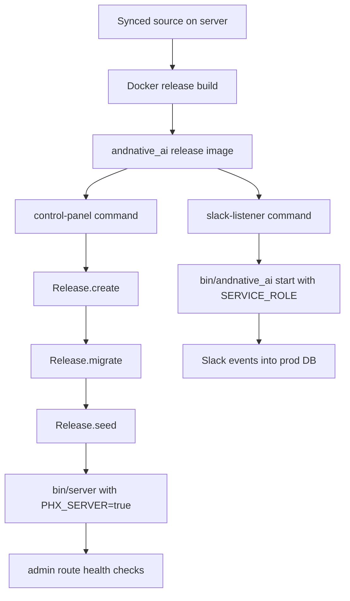

# fix: Run Hetzner deploy as a Phoenix production release

**Target repo:** andnative_ai

Replace the public Hetzner stack's dev-mode Phoenix server with a release-built production runtime. Keep the local development Docker path usable, preserve the current server data during the cutover, and document the operational contract so future deploy fixes do not reintroduce `mix phx.server` in production.

---

## Goal Capsule

- **Objective:** The deployed control panel and Slack listener run from a `MIX_ENV=prod` release image, with prod runtime config (`SECRET_KEY_BASE`, `DATABASE_URL`, `RESEND_API_KEY`, `force_ssl` posture) active.
- **Authority hierarchy:** Phoenix release guidance and repo-local deploy constraints outrank convenience shortcuts; live data preservation outranks a clean new database name if the two conflict during rollout.
- **Execution profile:** Standard infrastructure fix with release packaging, compose changes, release-time migrations/seeds, docs, and live deploy verification.
- **Stop condition:** Stop and surface a blocker if the existing server lacks required secrets, the database cannot be preserved or migrated, or the release image cannot pass the current admin-route health checks.

---

## Product Contract

### Problem Frame

The current deploy builds an Elixir dev image, bind-mounts the repo into `/app`, persists `deps` and `_build`, points at `andnative_ai_dev`, and starts `mix phx.server` without `MIX_ENV`. That makes the public server behave like local dev: prod-only `config/runtime.exs` branches do not apply, the dev secret signs sessions, debug/code-reload behavior is available, and Resend configuration only works when duplicated outside the prod block.

### Requirements

- R1. The Hetzner control panel runs as a Phoenix release with `MIX_ENV=prod`, digested assets, `PHX_SERVER=true`, and no repo bind mount over the release.
- R2. The Slack listener runs from the same release image as a worker process, with `SERVICE_ROLE=slack-listener` and without starting the HTTP server.
- R3. Runtime production config reads secrets from environment only: `SECRET_KEY_BASE` must be provided, and database configuration must use `DATABASE_URL` or an equivalent prod env contract.
- R4. Release startup can create the configured database when absent, run migrations, and run existing seeds without Mix being present in the final image.
- R5. The deploy path preserves the existing server data during the transition from the dev-named database to a prod-named database.
- R6. Local development Docker remains usable and continues to run the dev entrypoints with Mix.
- R7. Deploy docs explain the production release shape, required server env, manual release commands, one-time database preservation, and Resend expectations.
- R8. Repo instructions record that generated docs and PR text should avoid attributing work to language models.

### Scope Boundaries

**In scope:** Dockerfile stages, Hetzner compose, release helper scripts/modules, deploy workflow health checks if needed, deploy docs, and the requested `AGENTS.md` instruction.

**Out of scope:** moving off the shared Hetzner box, full secret-management automation, non-root container hardening, managed Postgres, zero-downtime blue/green rollout, and replacing Caddy.

---

## Planning Contract

### Key Technical Decisions

- KTD1. Build one release image and use different release commands per service. The application already role-gates Slack listener supervision with `SERVICE_ROLE`, so a single OTP release can serve both the control panel and the listener.
- KTD2. Keep the top-level `bin/control-panel` and `bin/slack-listener` as dev scripts, and add release overlay scripts with the same names inside `rel/overlays/bin`. Local compose can target the dev Docker stage while Hetzner targets the release stage.
- KTD3. Add an `AndnativeAi.Release` module for create/migrate/seed. A release cannot depend on Mix, and `priv/repo/seeds.exs` should remain the canonical seed script.
- KTD4. Use a prod-named database in compose, with a documented one-time data copy from `andnative_ai_dev` to `andnative_ai_prod` on the current host. Starting empty would make the fix look successful while losing configured users, Slack installs, sources, and memory.
- KTD5. Keep `DATABASE_URL` as the production contract, but allow runtime config to derive it from existing `DATABASE_*` parts if needed. This makes the app easier to run in Compose without weakening the Phoenix release path.
- KTD6. Verify the final image in CI/local with release-focused checks, then verify the live server by external auth status and internal admin route health.

### High-Level Technical Design

### Assumptions

- The server can retain `/opt/andnativeai/.env`; the deployment workflow already excludes it from rsync deletion.
- `SECRET_KEY_BASE` can be generated once on the server and kept out of git.
- Existing Caddy routing can keep proxying `andnative-control-panel:4000`.

---

## Implementation Units

### U1. Release Docker image and local dev target

**Goal:** R1, R6.
**Dependencies:** none.
**Files:** `Dockerfile`, `docker-compose.yml`, `.dockerignore`.
**Approach:** Split the Dockerfile into a reusable dev stage and a final release stage. The release stage should fetch prod deps, build/minify assets, compile, run `mix release`, copy only the assembled release into a slim runtime image, and include `curl` for health checks. Point local `docker-compose.yml` services at the dev target so local Mix-based scripts still work.
**Patterns to follow:** Phoenix release Docker guidance; current local compose command/volume shape.
**Test scenarios:**
- Building the dev target still provides `mix` and can run the existing local entrypoints.
- Building the release target produces `/app/bin/andnative_ai` and `/app/bin/control-panel` without requiring source bind mounts.
**Verification:** Docker release build succeeds; local compose config remains valid.

### U2. Release runtime commands and migration support

**Goal:** R1, R2, R4.
**Dependencies:** U1.
**Files:** `lib/andnative_ai/release.ex`, `rel/overlays/bin/server`, `rel/overlays/bin/control-panel`, `rel/overlays/bin/slack-listener`, `rel/overlays/bin/migrate`.
**Approach:** Add release-safe helpers that load the app, create storage when absent, migrate repos with `Ecto.Migrator.with_repo/2`, and evaluate `priv/repo/seeds.exs` under a started repo. Add overlay scripts: `control-panel` prepares writable dirs, creates/migrates/seeds, then starts the HTTP server with `PHX_SERVER=true`; `slack-listener` starts the release with `SERVICE_ROLE=slack-listener` and no HTTP server; `migrate` exposes a manual migration command.
**Patterns to follow:** Phoenix generated release task shape; existing `bin/control-panel` and `bin/slack-listener` operational order.
**Test scenarios:**
- `AndnativeAi.Release.create/0` treats an already-created database as success.
- `AndnativeAi.Release.migrate/0` runs all migrations under the configured repo in a release-compatible path.
- `AndnativeAi.Release.seed/0` runs existing seeds under a started repo without Mix.
**Verification:** focused release tests where practical; release eval commands work against the compose database.

### U3. Production compose and deploy workflow

**Goal:** R1, R2, R3, R5.
**Dependencies:** U1, U2.
**Files:** `deploy/hetzner-demo.compose.yml`, `.github/workflows/deploy-main.yml` if health or preflight changes are needed.
**Approach:** Point Hetzner services at the release Docker target, remove repo/deps/_build bind mounts, set `MIX_ENV=prod`, use a prod database name/URL, and keep persistent `var` mounts only where runtime data is written. Add a control-panel healthcheck so Slack waits until migrations and the HTTP server are ready. Add deploy preflight only if needed to fail clearly when `SECRET_KEY_BASE` is missing.
**Patterns to follow:** current Compose project names, Caddy network attachment, and GitHub Actions deploy flow.
**Test scenarios:**
- `docker compose -f deploy/hetzner-demo.compose.yml config` resolves without invalid mounts or missing build targets.
- Control panel and Slack listener share the same release image but start different roles.
- Missing `SECRET_KEY_BASE` fails at startup with the existing runtime error instead of silently entering dev mode.
**Verification:** compose config valid; release containers boot locally or on server; existing workflow health checks pass.

### U4. Runtime config and docs

**Goal:** R3, R7, R8.
**Dependencies:** U2, U3.
**Files:** `config/runtime.exs`, `docs/hetzner-demo-deploy.md`, `AGENTS.md`.
**Approach:** Keep the prod `DATABASE_URL` path as first choice and add a small fallback that assembles it from `DATABASE_HOST`, `DATABASE_PORT`, `DATABASE_NAME`, `DATABASE_USER`, and `DATABASE_PASSWORD` when `DATABASE_URL` is absent. Update deploy docs to describe release mode, required `.env`, one-time database preservation, release eval commands for seeding/resetting passwords, and Resend behavior under real prod config. Add the requested no-attribution instruction to `AGENTS.md`.
**Patterns to follow:** existing `docs/hetzner-demo-deploy.md` structure and AGENTS project-guideline list.
**Test scenarios:**
- Runtime config chooses `DATABASE_URL` when present.
- Runtime config derives a valid Ecto URL from database parts when all parts are present.
- Documentation contains no real secrets and no stale `mix run` commands for the release stack.
**Verification:** config tests or release boot checks cover database env behavior; docs audit finds no prod instructions that still claim the server runs `mix phx.server`.

### U5. Live cutover validation

**Goal:** R5 and the overall deploy outcome.
**Dependencies:** U1, U2, U3, U4.
**Files:** no required repo files beyond docs; server state changes are operational.
**Approach:** Before deploying, ensure `/opt/andnativeai/.env` has a strong `SECRET_KEY_BASE`. If the current server has data in `andnative_ai_dev`, copy it to `andnative_ai_prod` once before the release compose starts using the prod database. Deploy from `main`, then verify external auth status, internal admin route health, container restart stability, and a Resend-backed invite/reset path if credentials are configured.
**Patterns to follow:** current GitHub Actions deploy and `docs/hetzner-demo-deploy.md` manual verification.
**Test scenarios:** `Test expectation: none -- operational rollout; verification is via live health checks and logs.`
**Verification:** GitHub Actions deploy succeeds; `andnative-control-panel` and `andnative-slack-listener` stay up; `https://andnativeai.marcelfahle.net` returns the expected auth boundary; admin routes respond inside the container.

---

## Verification Contract

| Gate | Scope | Done signal |
| --- | --- | --- |
| `mix compile --warnings-as-errors` | Elixir compile/runtime config | Clean compile. |
| `mix test` or `mix precommit` | App behavior and release helper tests | Full suite green. |
| `docker compose -f deploy/hetzner-demo.compose.yml config` | Production Compose syntax | Valid resolved config. |
| `docker build --target release .` | Release packaging | Image builds with digested assets and release scripts. |
| Live deploy health | Hetzner runtime | Containers stable and admin routes healthy in prod release mode. |

---

## Definition of Done

- R1-R8 satisfied.
- `mix precommit` passes.
- Release Docker target builds and contains the release overlay commands.
- Hetzner compose no longer bind-mounts the repo, `deps`, or `_build` into production services.
- Production runtime requires a non-dev `SECRET_KEY_BASE` and runs under `MIX_ENV=prod`.
- Existing server data is either copied to `andnative_ai_prod` or the user explicitly accepts starting from an empty prod database.
- Deploy docs and AGENTS guidance are updated, with no committed secrets.
- Any dead-end deployment or experimental code is removed before shipping.

---

## Risks & Dependencies

| Risk | Likelihood | Impact | Mitigation |
| --- | --- | --- | --- |
| Existing server data is left in `andnative_ai_dev` and prod boots empty | Medium | High | Document and execute a one-time copy before deploying the prod DB name. |
| `SECRET_KEY_BASE` missing on server | Medium | High | Add preflight/docs and set it in `/opt/andnativeai/.env` before release boot. |
| Final release image lacks a library needed by bcrypt, SSL, or Bandit | Low | High | Use Phoenix release runtime packages and validate with Docker build/boot. |
| Slack listener starts before migrations finish | Medium | Medium | Add control-panel health dependency or keep listener migration-safe. |
| Local Docker development breaks | Medium | Medium | Keep a dev Docker target and point local compose at it. |

---

## Sources & Research

- Phoenix release docs via Context7 (`/phoenixframework/phoenix`): `MIX_ENV=prod mix release`, `config/runtime.exs` runtime configuration, `SECRET_KEY_BASE`, `DATABASE_URL`, `PHX_SERVER=true`, `mix assets.deploy`, and release Dockerfile shape.
- Codebase: `Dockerfile`, `deploy/hetzner-demo.compose.yml`, `.github/workflows/deploy-main.yml`, `config/runtime.exs`, `config/prod.exs`, `mix.exs`, `lib/andnative_ai/application.ex`, `bin/control-panel`, `bin/slack-listener`, `docs/hetzner-demo-deploy.md`.
- Prior plan: `docs/plans/2026-06-28-003-feat-resend-email-plan.md` explains why Resend should live under prod runtime config and why the dev-mode deploy masked it.
